# btb (Beyond the Box)

`btb` is a x86_64 / ARM / CUDA / MLX / NEON optimized harness that prioritizes using all available hardware on the machine, semi-greedily.  

**Run a 180B+ model without GPU**, **without needing quantization / GGUF**, and without waiting a week! The better your machine's hardware, the faster your inference will be. It will run on a laptop and a gaming PC alike.


It implements a **tiered access system**, prioritizing VRAM, RAM, and disk in that order. The harness is designed to allow for regular machine usage, such as playing a game, launching a memory-heavy application, et al. While it is greedy, it keeps a configurable buffer of free memory for the OS. When that buffer shrinks, RAM is freed accordingly from inference for other applications.

> **Notice:** This software pushes upwards of 3-4GB/s read from your drive, constantly. I **WOULDN'T** recommend running this on a HDD, though HDD support was taken into consideration. It however, does attempt to absolutely minimize the number of reads, see the [Bus Pass scheduler](./docs/disk-scheduler.md).

> **Disclaimer: This project contains AI written code, human reviewed, and experimental.**

## Features

- 🏡 **At-home access to LLM inference for everyone** :)
- ☮️ **Windows, macOS, Linux**
- 🏎️ **CUDA / MLX / NEON perf. that meets or beats llama.cpp**
- 🌈 **Fast(er) CPU inference** / **No GPU required** (sorry NVIDIA)
  - AVX2, AVX-512, NEON support
  - The more cores, the more performance
  - Single-core machines may struggle more due to inherent contention
- 🔍 **BF16 first, quant second**
  - **btb is bf16 first, opting to never sacrifice quality for speed**
  - **MoE included** - Yes, you can even run large MoE models in bf16. It _won't_ be the fastest, but it's better than impossible.
  - **No extra disk space required** - Run the models you already have
  - **GGUF / Quant. support** - However, if you already have a .gguf or quantized model, you can use it all the same.
  - **12-bit packing** 
    - For low memory systems, or large models where you don't want to sacrifice quality; btb offers its own form of lossless packing "pack12". 
    - This _does_ require about ~0.75x of the space of the base model in space on the disk, but it **opt-in** (see the `pack` subcommand).
- ⛓️ **Deterministic inference**
  - Deterministic sampling and inference across various devices
  - Blazing performance through some sorcery
  - n-gram and MTP tree optimizations + tuning
  - Support for top-k, top-p, and greedy - all highly optimized
- 📚 **Full context windows + automatic YaRN**
  - And no, you're not just limited to 256 or something.
  - Scale context windows to the model's max, or higher, with automatic YaRN configuration.
  - Operate at context lengths that definitely don't fit in VRAM :)
  - Conversational prefill / KV caching
- 🛠️ **Tools Included**:
  - `btb serve [model]` - OpenAI server
  - `btb ollama [model] --gui` - Open the Ollama GUI
  - `btb pi` - Configure a pi provider and start a server (tools **ARE** supported)
  - `btb chat` - Basic interactive chat without tools
- 😇 **Annoys Sam Altman**
- 🐍 **A plain Python API**

## Commercial Use

For commercial use, please contact [sales@relta.net](mailto:sales@relta.net). 
See the [LICENSE](./LICENSE.md) file for more information about the FSL-v1.1-ALv2 license.

## Installing

This package provides both wheel files for common platforms/architectures, as well as a sdist package (though not recommended).

### pip

```sh
pip install beyondthebox
pip install beyondthebox[mlx]      # Apple silicon: adds MLX, and the GPU is used by default
```

### From Source
To rebuild the library and the wheel from source, with a Rust toolchain:

```sh
git clone https://github.com/EvanDarwin/btb && cd btb
python build.py     # this machine, with the card's kernels when nvcc is here; --target <triple> cross-builds
pip install dist/*.whl
```

See [Building btb](./docs/building.md) for the prerequisites (Rust, CUDA/`nvcc`, MLX), the dev checks and tests, and cross-building.

## Usage

### OpenAI server

```sh
btb serve Qwen/Qwen3-4B --port 8000
```

```python
from openai import OpenAI

client = OpenAI(base_url="http://127.0.0.1:8000/v1", api_key="btb")
for chunk in client.chat.completions.create(
    model="qwen3-4b", stream=True, messages=[{"role": "user", "content": "Why is the sky blue?"}]
):
    print(chunk.choices[0].delta.content or "", end="", flush=True)
```

Every complete model in the Hugging Face cache (and `--models-dir`) is listed by name and loaded on demand, least recently used unloaded to make room; `--models-filter REGEX` narrows the list.

### Pi Agent
```
btb pi
```
This will modify your Pi configuration to add a new `btb` provider, which you can then launch with `pi --provider btb`. Tools are supported.

### Ollama

```sh
# For interactive terminal chat
btb ollama [model]

# For the GUI
btb ollama [model] --gui
```

Starts the server and runs `ollama run qwen3-4b`; anything after the options goes to `ollama run`. `--gui` opens the Ollama desktop app on it instead (quit the app before restarting btb, it holds the port).

### One prompt, or a chat in the terminal

```sh
btb run Qwen/Qwen3-4B -q -p "What is the capital of France?"
# The capital of France is **Paris**.

btb run Qwen/Qwen3-4B -q --json -p "What does CPU stand for?"
# {"answer": "CPU stands for **Central Processing Unit**. …", "took": 4.25, "stop": "eos", "stats": {"tokens_per_sec": 13.9, "tokens_in": 18, "tokens_out": 59, "tokens_per_pass": 1.0}}

btb chat Qwen/Qwen3-4B
# Basic interactive chat window
```

The model path is a local directory or a Hugging Face repo id. A repo not already in the cache is downloaded, and btb asks first, naming the size where the Hub reports it; pass `--confirm` (or set `BTB_CONFIRM=1`) to answer yes ahead of time, which a non-interactive run needs to fetch anything.

### From code

```python
import btb

with btb.load("Qwen/Qwen3-4B") as model:
    print(model.ask("What is the capital of France?"))
    for piece in model.stream("Name three uses of a paperclip.", max_new=64):
        print(piece, end="", flush=True)
```

## Options

These options apply to all commands that accept a model name / path.

`btb` is designed to run automatically, picking the best configuration for your current hardware setup at runtime. These options are simply if you want to play/experiment or fine-tune placement of weight layers between CPU/GPU.

Every command that loads a model takes these. The placement is planned from the machine's free memory at load; the flags override it.

| option | what it does | default |
|---|---|---|
| `-d, --device <cuda\|cuda:N\|mlx\|cpu>` | `cuda`: the card (and CPU) (`cuda:N` a specific card);<br/>`mlx`: Apple silicon's GPU over unified memory;<br/>`cpu`: the CPU alone | the card, else `mlx` on Apple silicon, else `cpu` |
| `-v, --verbose` | enable verbose output, prints placement, tiers, and each turn's timings | off |
| `--confirm` | answer yes to prompts, such as downloading an uncached model from the Hub; required to fetch one in a non-interactive run | ask at a terminal, refuse without one |
| `--profile DIR` | write the run's profile to DIR: `report.json` (the engine's ledger) and `events.npz` (the expert-store trace of a mixture of experts); attach it to an issue beside the crash report a failed run prints | off |
| `--native LIB` | path to the native library; `none` runs on torch alone | use btb's bundled native kernels |
| `--cpu-layers N` | the first $N$ layers run on the CPU from RAM | auto-configured |
| `--cold-slots N` | slots the reader streams layers from the drive into, ahead of the compute | auto-configured |
| `--resident-last N` | the last $N$ layers stay on the GPU | auto-configured |
| `--resident-head 0\|1` | `1`: output head resident on GPU<br/>`0`: output head resident on CPU | auto-configured; `1` on MLX |
| `--fp32 0\|1`<br/><sub>This option itself is a feature for fun and precision testing, but fp32 truly is faster on some CPU architectures. | `1`: use fp32 calculations; <br/>`0`: use bf16 calculations (faster) | `1` on the CPU, otherwise defaults to `0` |
| `--kv-host 0\|1`<br/><sub>When provided, forces the cache to RAM/VRAM instead of letting the planner decide.</sub> | `1`: forces the attn cache on the host's RAM<br/>`0`: forces the attn cache on the card | auto-configured; CUDA only |
| `--kv-bits 8` | MLX: denser attention cache as int8 with a scale per row (half the bytes; lossy, about 0.4% of a row's largest magnitude) | off: the cache stays bf16, the model's own dtype |
| `--context N` | window length; past the model's own window YaRN scaling is applied | the model's own window and its own rope as shipped; only a `--context` past the window of a model with a plain rope applies YaRN, factor = ceil(context / window) |
| `--expert-cache-gb GB` | RAM limit for the model's MoE store | the free RAM above the reserve, grown into as needed |
| `--ram-reserve GB\|%` | specifies how much RAM to keep free on the host for other apps | 10% of RAM, or OS floor + growth; whichever is more |
| `--vram-reserve GB\|%` | specifies how much VRAM to keep free on the host for other apps | 0.5 GB, or 8% of a smaller card |
| `--vram-watch 0\|1`<br/><sub>This option describes enables/disables `btb`'s behavior under contention. When true, it aims for no apps OOMing. When false, it plans once and sticks to it - making other apps take the OOM. | `1`: free RAM/VRAM under contention, reclaim it when available again<br/>`0`: fit the model to the hardware once and don't readjust | `1` |
| `--no-spec` | disables speculative decoding | _disabled_ |
| `--tree-budget N` | the draft tree's size per pass; `0` turns the tree off | with drafting head: mlx = `14`, cuda = `15`, cpu = `16`<br/>without: on a card holding every layer, `15`; otherwise `0` |
| `--v-max N` | drafted tokens verified per pass; `0` decodes one token at a time | `4`; `0` for a mixture of experts |
| `--tree-min-prob P` | minimum draft path probability kept in the tree | `0.15` |
| `--tree-step-mass P` | a drafting step runs only when the nodes it would extend carry this much path probability; `0` always steps | `0.5` |
| `--ngram-p P` | acceptance threshold of the n-gram drafter | `0.9` |
| `--draft-vocab N` | the drafting head scores only the first $N$ token ids (the frequent part of a BPE vocabulary); `0` scores all | `32768` with a drafting head, else all |
| `--draft-bits 4\|8\|16`<br/><sub>This option is only recognized when running under MLX.</sub> | the drafting head's weights packed in memory at first use to N bits | `8` on MLX only, otherwise ignored |
| `--mlx-mega 0\|1`<br/><sub>When enabled, requires ~600MB of arena/scratch space | MLX: the dense pass as one Metal dispatch (the megakernel; bit-exact w/ fused path) | `1` where it builds (dense Qwen3, every layer resident) |
| `--temperature T` | `0` takes the likeliest token; above `0`, each logit is divided by $T$, deterministic noise keyed by the seed and the token's position is added, and the argmax is taken, so higher $T$ draws more widely and one seed repeats its answer. | `0` |
| `--top-p P` | draw from the fewest likeliest tokens whose probability reaches $P$ | `1` (every token) |
| `--top-k K` | draw from the $K$ likeliest tokens | `0` (every token) |
| `--seed N` | the draws' seed: a prompt and a seed repeat their answer | drawn per call, reported in the stats |
| `--draft-temperature R` | under a temperature the drafting head draws its tree at $R \cdot T$; the verified answer's distribution is the same at any $R$, the accepted drafts a pass are not | `1` |

Each command's own arguments (`btb <command> --help` lists them):

- `run PATH`: `-p, --prompt` (else stdin, else a sample prompt), `--file JSONL` (one `{"prompt": ...}` per line, a fresh context each), `--new N`, `--raw` (keep special tokens), `-q, --quiet`, `--json` (one record per prompt), `--out PATH`.
- `chat PATH`: `--file JSONL` (scripted turns, one `{"user": ...}` per line), `--new N`; `/reset` clears, `/quit` exits.
- `bench PATH --prompts JSONL`: `--rows I,J,...` (default all), `--new N,N,...` (default `64,256,1024`), `--label LABEL`, `--out JSONL`; always greedy.
- `serve [PATH]`: `--host` (default `127.0.0.1`), `--port` (default `8000`), `--new N` (a ceiling per request), `--api-key KEY` (required on every request as `Authorization: Bearer KEY`; default `BTB_API_KEY` from the environment, else none), `--models-dir DIR` (repeatable), `--models-filter REGEX`; no path starts empty.
- `ollama [PATH]`: `serve`'s arguments, `--port` default `11435`, `--gui` (the desktop app instead of the terminal chat); anything unrecognized goes to `ollama run`.
- `pi [PATH]`: `serve`'s arguments (`--api-key` included, written into the provider entry), `--no-configure` (print the provider entry instead of writing `~/.pi/agent/models.json`), `--config PATH` (write it elsewhere).
- `pack PATH [OUT]`: the lossless 12-bit model beside the model (`<model>-pack12`, a model like any other), or at `OUT`; `--confirm` to fetch an uncached repo without a terminal.
- `devices`: `-q` (one name per line), `--json`.

## The 12-bit store

Optional and lossless: the same bf16 numbers in 12 bits each, 0.75x the read from disk. Written only by `pack`, into its own directory; the checkpoint is untouched; runs find the store on their own.

```sh
btb pack /models/Qwen3.8-27B              # writes /models/Qwen3.8-27B-pack12
btb pack /models/Qwen3.8-27B /fast/disk/Qwen3.8-27B-pack12
```

`pack` checks the free space first and refuses if the store does not fit. It pays when the model reads from disk every token (the 27B on 64 GB: 54 GB a pass from the checkpoint, 40 GB from the store).

## Models

**Supported families** (so far, I'm out of disk space): 
* Qwen3.5-style hybrids (`qwen3_5`)
* Qwen3 dense (`qwen3`)
* Phi-3-style dense (`phi3`) and the Qwen4 MoE (`qwen4_exp`; transformers 5.16 or later)
* OpenAI gpt-oss (`gpt_oss`): attention sinks, 128-token windows, MXFP4 experts streamed from the drive as stored (the 120B's experts are 61 GB, never expanded)

## How?

- I refused to accept quantization
- A 10-week research project into LLM inference
- Iterative optimization
- Avoid reading layers you don't need
- Take lossless shortcuts
- Proper utilization of scheduling between devices
- A tree, determinism, and a touch of magic

## Benchmarks (Windows)

All benchmarks use the same `bench/questions.json` prompts, and `bench.py` and `compare.py` scripts - and they are provided for reproducibility. 

The following configuration is used:
* No bf16 for CPU runs
* Runs to $64$, $256$, and $1024$ tokens
* `tok/s` is the rate _after_ the first token, averaged over the prompts
* `first_token` is the prefill at $256$
* Peak RAM represents the process's peak working set
* Peak VRAM is peak reserved VRAM by the scheduler
* Greedy decoding for now (will do temp. later)


`bench/matrix.py` runs every device configuration against every complete model in the cache (`--devices`, `--filter`, `--models`), one `btb bench` process per cell, and writes the table (`--markdown`) and a JSON of every cell under `bench/results/`.

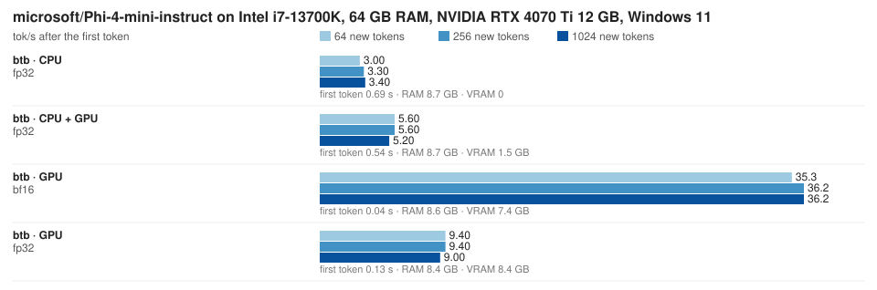

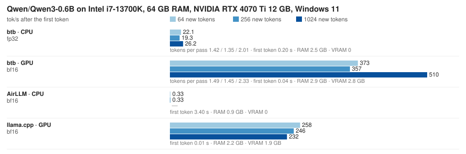

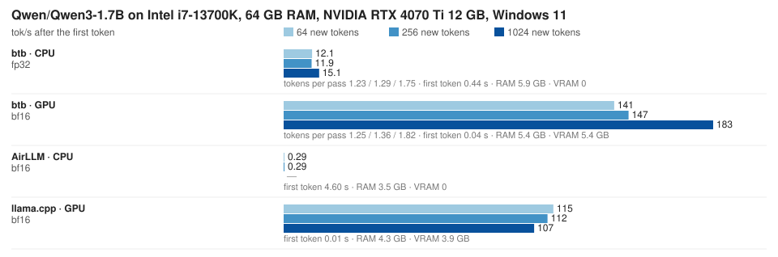

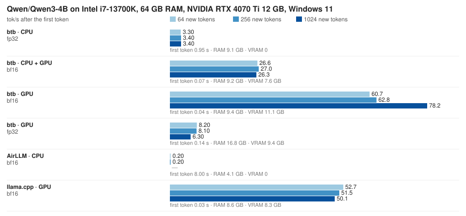

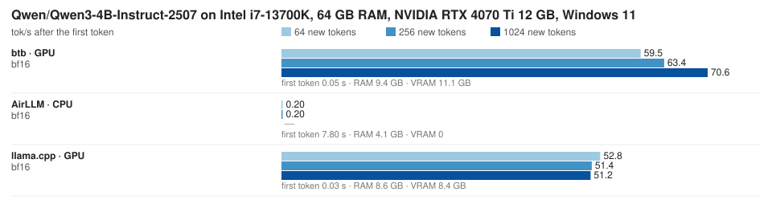

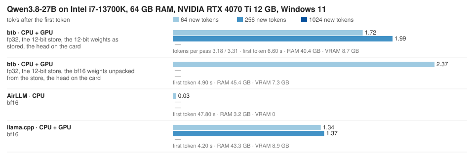

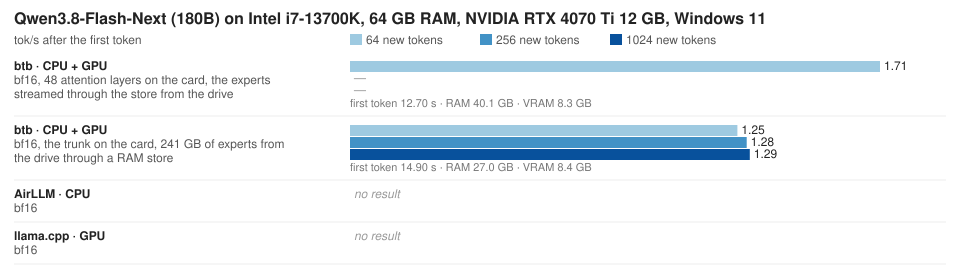

<details>
<summary>The table</summary>

| model | engine | device | how it runs | tok/s at 64 / 256 / 1024 | tokens per pass | first token | peak RAM | peak VRAM |
|---|---|---|---|---|---|---|---|---|
| Qwen3-0.6B | btb | CPU | fp32 over bf16 weights, all layers on the CPU, the n-gram tree | 22.1 / 19.3 / 26.2 | 1.42 / 1.35 / 2.01 | 0.20 s | 2.5 GB | 0 |
| Qwen3-0.6B | btb | CPU | fp32 over bf16 weights, all layers on the CPU, greedy | 17.1 / 15.7 / 15.7 | 1.00 | 0.20 s | 2.5 GB | 0 |
| Qwen3-0.6B | btb | GPU | bf16, the whole model on the card, four steps a graph | 286.8 / 297.1 / 270.9 | 1.00 | 0.04 s | 2.9 GB | 2.8 GB |
| Qwen3-0.6B | btb | GPU | bf16, the whole model on the card, the n-gram tree, a verify pass a graph | 373.0 / 357.2 / 510.4 | 1.49 / 1.45 / 2.33 | 0.04 s | 2.9 GB | 2.8 GB |
| Qwen3-0.6B | llama.cpp | GPU | bf16, the whole model on the card (bf16 GGUF, llama-cpp-python, CUDA 13) | 258.3 / 245.8 / 232.3 | 1.00 | 0.01 s | 2.2 GB | 1.9 GB |
| Qwen3-0.6B | AirLLM | CPU | per-layer streaming on the CPU | 0.33 / 0.33 / — | 1.00 | 3.4 s | 0.9 GB | 0 |
| Qwen3-1.7B | btb | CPU | fp32 over bf16 weights, all layers on the CPU, the n-gram tree | 12.1 / 11.9 / 15.1 | 1.23 / 1.29 / 1.75 | 0.44 s | 5.9 GB | 0 |
| Qwen3-1.7B | btb | CPU | fp32 over bf16 weights, all layers on the CPU, greedy | 10.5 / 10.2 / 10.2 | 1.00 | 0.44 s | 5.9 GB | 0 |
| Qwen3-1.7B | btb | GPU | bf16, the whole model on the card, two steps a graph | 116.3 / 118.2 / 113.8 | 1.00 | 0.04 s | 5.4 GB | 5.4 GB |
| Qwen3-1.7B | btb | GPU | bf16, the whole model on the card, the n-gram tree, a verify pass a graph | 140.7 / 146.8 / 182.8 | 1.25 / 1.36 / 1.82 | 0.04 s | 5.4 GB | 5.4 GB |
| Qwen3-1.7B | llama.cpp | GPU | bf16, the whole model on the card (bf16 GGUF, llama-cpp-python, CUDA 13) | 114.8 / 112.3 / 106.6 | 1.00 | 0.01 s | 4.3 GB | 3.9 GB |
| Qwen3-1.7B | AirLLM | CPU | per-layer streaming on the CPU | 0.29 / 0.29 / — | 1.00 | 4.6 s | 3.5 GB | 0 |
| Qwen3-4B | btb | CPU | fp32 over bf16 weights, all layers on the CPU | 3.3 / 3.4 / 3.4 | 1.00 | 0.95 s | 9.1 GB | 0 |
| Qwen3-4B | btb | CPU + GPU | bf16 weights on the card, attention cache in RAM | 26.6 / 27.0 / 26.3 | 1.00 | 0.07 s | 9.2 GB | 7.6 GB |
| Qwen3-4B | btb | GPU | bf16, the whole model on the card | 27.7 / 27.9 / 27.0 | 1.00 | 0.04 s | 9.0 GB | 8.3 GB |
| Qwen3-4B | btb | GPU | fp32 over bf16 weights, the whole model on the card | 8.2 / 8.1 / 6.3 | 1.00 | 0.14 s | 16.8 GB | 9.4 GB |
| Qwen3-4B | btb | GPU | bf16, the whole model on the card, one step a graph | 53.0 / 52.9 / 52.2 | 1.00 | 0.04 s | 9.4 GB | 11.1 GB |
| Qwen3-4B | btb | GPU | bf16, the whole model on the card, the n-gram tree, a verify pass a graph | 60.7 / 62.8 / 78.2 |  | 0.04 s | 9.4 GB | 11.1 GB |
| Qwen3-4B | llama.cpp | GPU | bf16, the whole model on the card (bf16 GGUF, llama-cpp-python, CUDA 13) | 52.7 / 51.5 / 50.1 | 1.00 | 0.03 s | 8.6 GB | 8.3 GB |
| Qwen3-4B | AirLLM | CPU | per-layer streaming on the CPU | 0.20 / 0.20 / — | 1.00 | 8.0 s | 4.1 GB | 0 |
| Qwen3-4B-Instruct-2507 | btb | GPU | bf16, the whole model on the card, one step a graph | 53.9 / 53.7 / 52.4 | 1.00 | 0.05 s | 9.4 GB | 11.1 GB |
| Qwen3-4B-Instruct-2507 | btb | GPU | bf16, the whole model on the card, the n-gram tree, a verify pass a graph | 59.5 / 63.4 / 70.6 |  | 0.05 s | 9.4 GB | 11.1 GB |
| Qwen3-4B-Instruct-2507 | llama.cpp | GPU | bf16, the whole model on the card (bf16 GGUF, llama-cpp-python, CUDA 13) | 52.8 / 51.4 / 51.2 | 1.00 | 0.03 s | 8.6 GB | 8.4 GB |
| Qwen3-4B-Instruct-2507 | AirLLM | CPU | per-layer streaming on the CPU | 0.20 / 0.20 / — | 1.00 | 7.8 s | 4.1 GB | 0 |
| Phi-4-mini-instruct | btb | CPU | fp32 over bf16 weights, all layers on the CPU | 3.0 / 3.3 / 3.4 | 1.00 | 0.69 s | 8.7 GB | 0 |
| Phi-4-mini-instruct | btb | CPU + GPU | fp32, 32 layers on the CPU, the head on the card | 5.6 / 5.6 / 5.2 | 1.00 | 0.54 s | 8.7 GB | 1.5 GB |
| Phi-4-mini-instruct | btb | GPU | bf16, the whole model on the card | 35.3 / 36.2 / 36.2 | 1.00 | 0.04 s | 8.6 GB | 7.4 GB |
| Phi-4-mini-instruct | btb | GPU | fp32 over bf16 weights, the whole model on the card | 9.4 / 9.4 / 9.0 | 1.00 | 0.13 s | 8.4 GB | 8.4 GB |
| Qwen3.8-27B | btb | CPU | fp32, 64 layers from the 12-bit store, the tree | pending | pending | pending | pending | 0 |
| Qwen3.8-27B | btb | CPU + GPU | fp32, 64 layers on the CPU from the 12-bit store, the head on the card, the tree | 1.72 / 1.99 / pending | 3.18 / 3.31 / pending | 6.6 s | 40.4 GB | 8.7 GB |
| Qwen3.8-27B | btb | CPU + GPU | fp32 over the bf16 weights from the 12-bit store, 64 layers on the CPU, the head on the card, greedy | 1.34 / pending / pending | 1.00 | 4.9 s | 45.4 GB | 7.3 GB |
| Qwen3.8-27B | btb | CPU + GPU | fp32 over the bf16 weights from the 12-bit store, 64 layers on the CPU, the head on the card, the tree | 2.37 / pending / pending |  | 4.9 s | 45.4 GB | 7.3 GB |
| Qwen3.8-27B | llama.cpp | CPU + GPU | bf16, 10 of 64 layers on the card, the rest on the CPU (bf16 GGUF, llama-cpp-python, CUDA 13) | 1.34 / 1.37 / — | 1.00 | 4.2 s | 43.3 GB | 8.9 GB |
| Qwen3.8-27B | AirLLM | CPU | per-layer streaming on the CPU | 0.03 / — / — | 1.00 | 47.8 s | 3.2 GB | 0 |
| Qwen3.8-Flash-Next (180B) | btb | CPU | bf16 trunk and experts, the experts from the drive through a RAM store | pending | 1.00 | pending | pending | 0 |
| Qwen3.8-Flash-Next (180B) | btb | CPU + GPU | bf16 trunk on the card, 241 GB of experts from the drive through a RAM store | 1.25 / 1.28 / 1.29 | 1.00 | 14.9 s | 27.0 GB | 8.4 GB |
| Qwen3.8-Flash-Next (180B) | btb | CPU + GPU | bf16, 48 attention layers on the card, the experts streamed through the store from the drive, greedy | 1.71 / pending / pending | 1.00 | 12.7 s | 40.1 GB | 8.3 GB |
| Qwen3.8-Flash-Next (180B) | llama.cpp / AirLLM | — | no result: no runtime for the Qwen4 experts / the MXFP4 experts dequantized (240 GB) |  |  |  |  |  |
| gpt-oss-120b | btb | CPU | fp32 over the bf16 trunk, 61 GB of MXFP4 experts from the drive through a RAM store, multiplied in their stored form | pending | 1.00 | pending | pending | 0 |
| gpt-oss-120b | btb | CPU + GPU | bf16 trunk on the card (4.2 GB), 61 GB of MXFP4 experts from the drive through a RAM store, on the CPU kernels | pending | 1.00 | pending | pending | pending |

</details>

Long contexts: Qwen3-4B with the weights on the card and the attention cache in RAM (`--kv-host 1`), a document followed by two questions about it; `--context 131072` past the model's 40,960-token window applies YaRN 4.

| context (tokens) | first-turn prefill | decode s/token | cache in RAM | peak VRAM |
|---|---|---|---|---|
| pending | | | | |

## Benchmarks (Apple silicon)

Benchmarked on:
* Apple M3 Pro (12 cores, 18-core GPU)
* 36 GB unified memory
* macOS 26.6

The same prompts and answer lengths; peak MLX is the GPU's share of unified memory (part of peak RAM). The Qwen rows are `bench/results/m3pro-20260910.json` (btb f371e14) and `m3pro-20260910-compare.json`; the Phi-4-mini and gpt-oss-120b btb rows are the earlier run's.

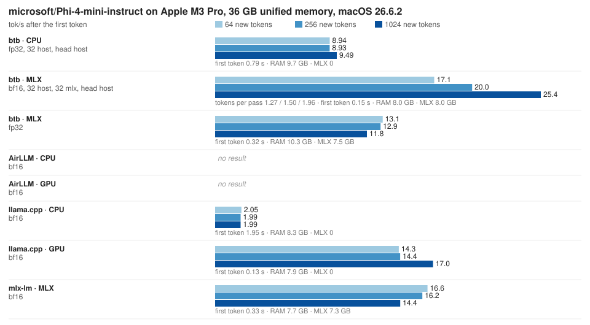

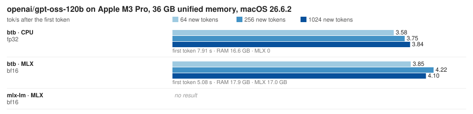

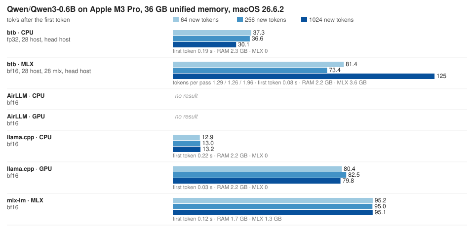

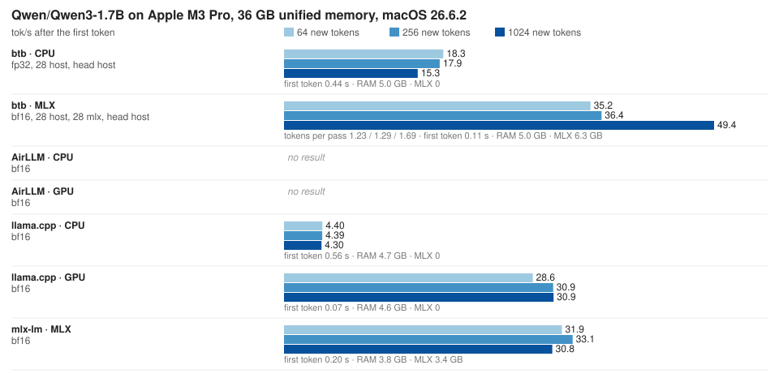

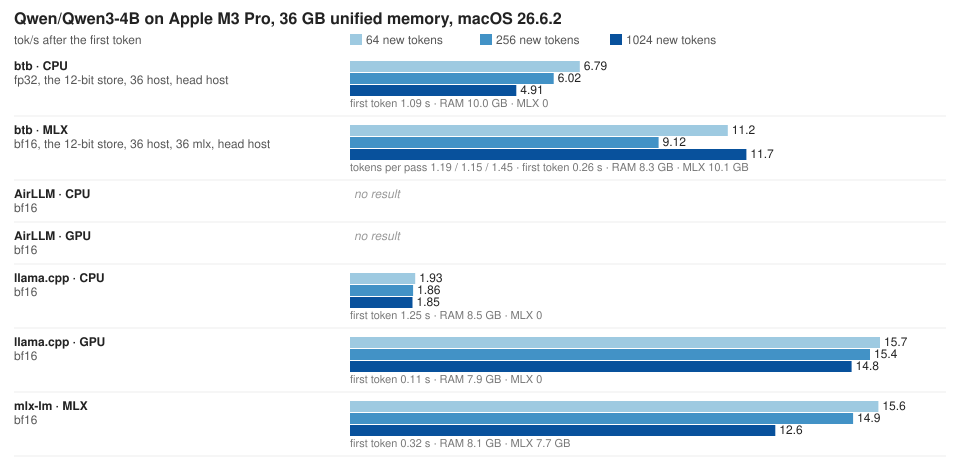

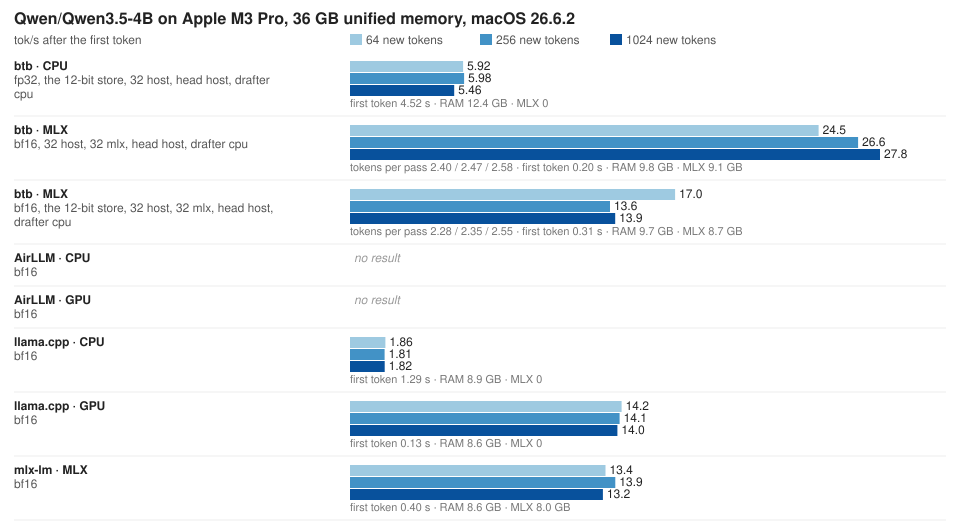

<details>
<summary>The table</summary>

| model | engine | device | how it runs | tok/s at 64 / 256 / 1024 | tokens per pass | first token | peak RAM | peak MLX |
|---|---|---|---|---|---|---|---|---|
| Qwen3-0.6B | btb | MLX | bf16, the megakernel, the n-gram tree (default) | 81.4 / 73.4 / 124.6 | 1.29 / 1.26 / 1.96 | 0.08 s | 2.2 GB | 3.6 GB |
| Qwen3-0.6B | btb | MLX | bf16, the megakernel, greedy | 63.6 / 59.2 / 63.8 | 1.00 | 0.08 s | 2.2 GB | 3.6 GB |
| Qwen3-0.6B | btb | CPU | fp32 over bf16, every layer on the CPU kernels | 37.3 / 36.6 / 30.1 | 1.00 | 0.19 s | 2.3 GB | 0 |
| Qwen3-0.6B | mlx-lm 0.31.3 | MLX | bf16, its own generate (no speculation) | 95.2 / 95.0 / 95.1 | 1.00 | 0.12 s | 1.7 GB | 1.3 GB |
| Qwen3-0.6B | llama.cpp 0.3.35 | Metal | bf16 GGUF, every layer on the GPU | 80.4 / 82.5 / 79.8 | 1.00 | 0.03 s | 2.2 GB | 0 |
| Qwen3-0.6B | llama.cpp 0.3.35 | CPU | bf16 GGUF, no layer on the GPU | 12.9 / 13.0 / 13.2 | 1.00 | 0.22 s | 2.2 GB | 0 |
| Qwen3-0.6B | AirLLM 4.0.0 | — | no result: on macOS its persister is the MLX one, whose splits its torch model cannot load; its card regime is CUDA only |  |  |  |  |  |
| Qwen3-1.7B | btb | MLX | bf16, the megakernel, the n-gram tree (default) | 17.8 / 15.9 / 25.0 | 1.10 / 1.10 / 1.30 | 0.24 s | 4.9 GB | 5.5 GB |
| Qwen3-1.7B | btb | MLX | bf16, the megakernel, greedy | 16.3 / 15.1 / 16.9 | 1.00 | 0.24 s | 4.9 GB | 5.5 GB |
| Qwen3-1.7B | btb | CPU | fp32 over bf16, every layer on the CPU kernels | 11.3 / 11.6 / 9.01 | 1.00 | 0.49 s | 4.8 GB | 0 |
| Qwen3-1.7B | mlx-lm 0.31.3 | MLX | bf16, its own generate (no speculation) | 35.0 / 35.5 / 35.4 | 1.00 | 0.15 s | 3.8 GB | 3.4 GB |
| Qwen3-1.7B | llama.cpp 0.3.35 | Metal | bf16 GGUF, every layer on the GPU | 35.6 / 34.6 / 33.4 | 1.00 | 0.05 s | 4.6 GB | 0 |
| Qwen3-1.7B | llama.cpp 0.3.35 | CPU | bf16 GGUF, no layer on the GPU | 4.45 / 4.37 / 4.29 | 1.00 | 0.54 s | 4.6 GB | 0 |
| Qwen3-1.7B | AirLLM 4.0.0 | — | no result: on macOS its persister is the MLX one, whose splits its torch model cannot load; its card regime is CUDA only |  |  |  |  |  |
| Qwen3-4B | btb | MLX | bf16, the megakernel, the n-gram tree (default) | 11.2 / 9.12 / 11.7 | 1.19 / 1.15 / 1.45 | 0.26 s | 8.3 GB | 10.1 GB |
| Qwen3-4B | btb | MLX | bf16, the megakernel, greedy | 8.94 / 8.34 / 8.20 | 1.00 | 0.26 s | 8.3 GB | 10.1 GB |
| Qwen3-4B | btb | MLX + drive | bf16, 30 of 36 layers from the 12-bit store streamed into shared slots, unpacked on the GPU | 1.1 (0.91 s/token) | 1.00 |  | 4.5 GB | 3.5 GB |
| Qwen3-4B | btb | CPU | fp32 over bf16, every layer on the CPU kernels | 6.79 / 6.02 / 4.91 | 1.00 | 1.09 s | 10.0 GB | 0 |
| Qwen3-4B | mlx-lm 0.31.3 | MLX | bf16, its own generate (no speculation) | 15.6 / 14.9 / 12.6 | 1.00 | 0.32 s | 8.1 GB | 7.7 GB |
| Qwen3-4B | llama.cpp 0.3.35 | Metal | bf16 GGUF, every layer on the GPU | 15.7 / 15.4 / 14.8 | 1.00 | 0.11 s | 7.9 GB | 0 |
| Qwen3-4B | llama.cpp 0.3.35 | CPU | bf16 GGUF, no layer on the GPU | 1.93 / 1.86 / 1.85 | 1.00 | 1.25 s | 8.5 GB | 0 |
| Qwen3-4B | AirLLM 4.0.0 | — | no result: on macOS its persister is the MLX one, whose splits its torch model cannot load; its card regime is CUDA only |  |  |  |  |  |
| Qwen3.5-4B (hybrid) | btb | MLX | bf16, the DeltaNet in MLX, the tree from its drafting head (budget 14) | 24.5 / 26.6 / 27.8 | 2.40 / 2.47 / 2.58 | 0.20 s | 9.8 GB | 9.1 GB |
| Qwen3.5-4B (hybrid) | btb | MLX | bf16, greedy | 12.6 / 13.4 / 13.4 | 1.00 | 0.20 s | 9.8 GB | 9.1 GB |
| Qwen3.5-4B (hybrid) | btb | CPU | fp32 over bf16, every layer on the CPU kernels, the DeltaNet on the native kernel | 5.92 / 5.98 / 5.46 | 1.00 | 4.52 s | 12.4 GB | 0 |
| Qwen3.5-4B (hybrid) | mlx-lm 0.31.3 | MLX | bf16, its own generate (no speculation) | 13.4 / 13.9 / 13.2 | 1.00 | 0.40 s | 8.6 GB | 8.0 GB |
| Qwen3.5-4B (hybrid) | llama.cpp 0.3.35 | Metal | bf16 GGUF, every layer on the GPU | 14.2 / 14.1 / 14.0 | 1.00 | 0.13 s | 8.6 GB | 0 |
| Qwen3.5-4B (hybrid) | llama.cpp 0.3.35 | CPU | bf16 GGUF, no layer on the GPU | 1.86 / 1.81 / 1.82 | 1.00 | 1.29 s | 8.9 GB | 0 |
| Qwen3.5-4B (hybrid) | AirLLM 4.0.0 | — | no result: on macOS its persister is the MLX one, whose splits its torch model cannot load; its card regime is CUDA only |  |  |  |  |  |
| Phi-4-mini-instruct | btb | MLX | bf16, n-gram drafts in passes of up to 5 rows | 16.5 / 15.7 / 19.3 | 1.19 / 1.10 / 1.44 | 0.11 s | 8.0 GB | 7.8 GB |
| Phi-4-mini-instruct | btb | MLX | bf16, greedy | 15.6 / 15.6 / 15.4 | 1.00 | 0.11 s | 8.0 GB | 7.8 GB |
| Phi-4-mini-instruct | mlx-lm 0.31.3 | MLX | bf16, its own generate (no speculation) | 14.7 / 15.9 / 14.8 | 1.00 | 0.31 s | 7.7 GB | 7.3 GB |
| Phi-4-mini-instruct | llama.cpp 0.3.35 | Metal | bf16 GGUF, every layer on the GPU | 16.9 / 16.7 / 16.3 | 1.00 | 0.09 s | 7.9 GB | 0 |
| Phi-4-mini-instruct | llama.cpp 0.3.35 | CPU | bf16 GGUF, no layer on the GPU | 2.05 / 2.03 / 2.01 | 1.00 | 3.48 s | 8.3 GB | 0 |
| Phi-4-mini-instruct | AirLLM 4.0.0 | — | no result: on macOS its persister is the MLX one, whose splits its torch model cannot load; its card regime is CUDA only |  |  |  |  |  |
| gpt-oss-120b | btb | MLX | bf16 trunk, 61 GB of MXFP4 experts from the drive through a RAM store, multiplied on the GPU as stored; greedy | 3.27 / 4.25 / 4.09 | 1.00 | 6.94 s | 27.5 GB | 27.4 GB |
| gpt-oss-120b | btb | CPU | fp32 over the bf16 trunk, the experts from the drive through the RAM store as stored; greedy | 4.41 / 5.20 / 5.19 | 1.00 | 5.74 s | 23.7 GB | 0 |

</details>

Long contexts: Qwen3.5-4B (hybrid), a prompt of that many tokens, then decoding.

| context (tokens) | prefill tok/s | decode ms/token | mlx-lm decode ms/token |
|---|---|---|---|
| 1,024 | 630 | 76 | 70 |
| 4,096 | 593 | 84 | 75 |
| 8,192 | 509 | 82 | 75 |
| 16,384 | 405 | 95 | 94 |
| 32,768 | | 119 | |

## Tests

```sh
python build.py check           # ruff (lint + format), mypy, cargo fmt + clippy: what a change must pass
python build.py test --fast     # tests/test_unit.py: discovery, the 12-bit format, the scheduler, the bench's planning, the native boundary checks (seconds)
python tests/test_receipts.py
python tests/test_mlx.py        # on a Mac: the Metal kernels, and their batch invariance bit for bit
```

`python build.py check` needs ruff, mypy, pytest and a Rust toolchain with clippy; `python build.py test` runs every suite.

The receipts run the engine on seed-0 fixture models (a Qwen3.5 hybrid, a Phi-3, a Qwen3, a Qwen4 MoE; no third-party weights) against banked reference tensors and must print `0.000e+00` on x86-64 (banked by the AVX-512 kernel; scalar and NEON held to 1e-5). On MLX the same receipts are held to 1e-4 with identical tokens.

## License

Functional Source License, Version 1.1, ALv2 Future License (FSL-1.1-ALv2). See `LICENSE.md`.

Copyright 2026 Evan Darwin.
